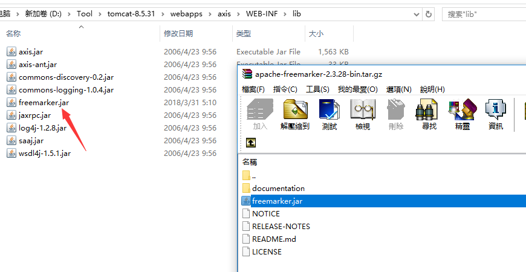
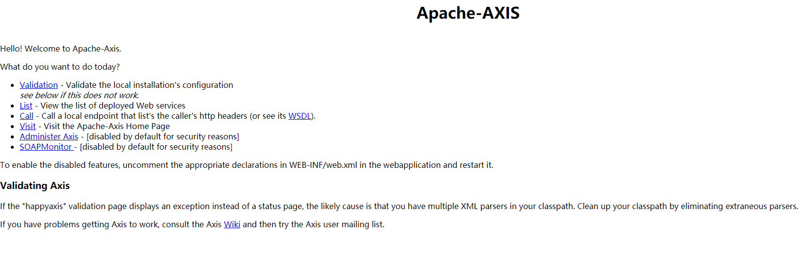
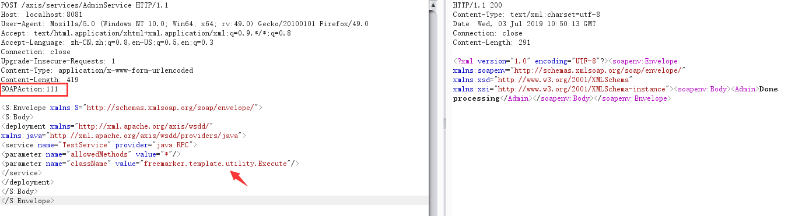
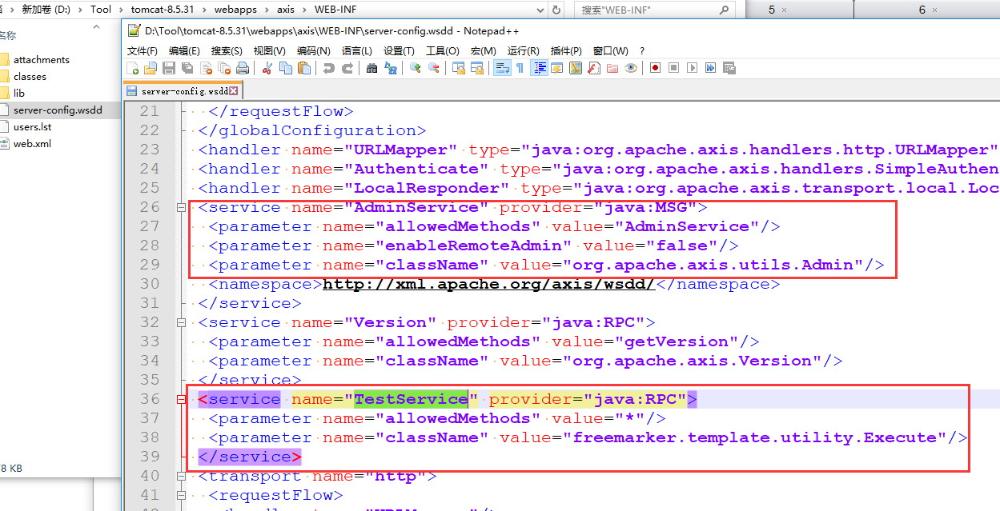
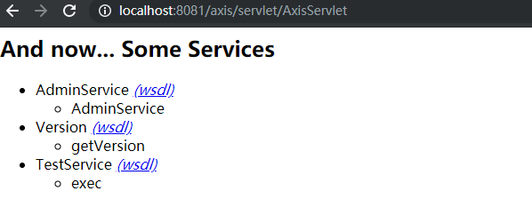
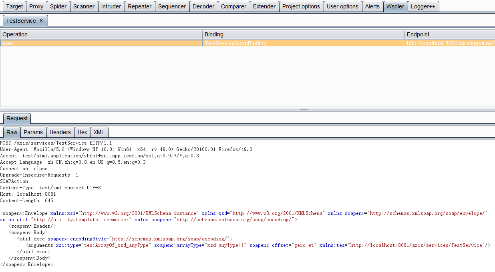
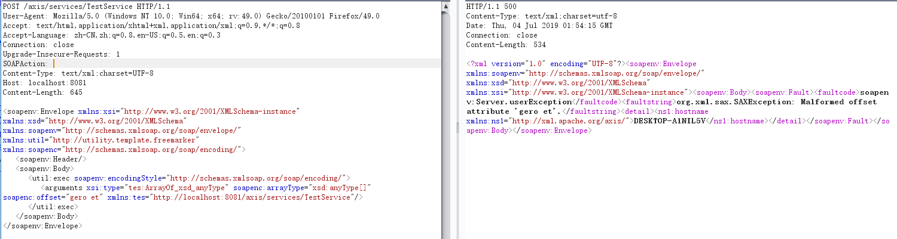
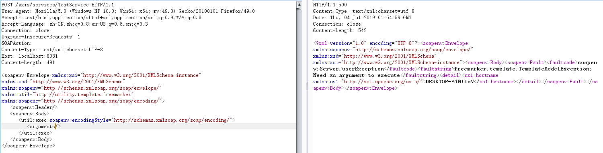
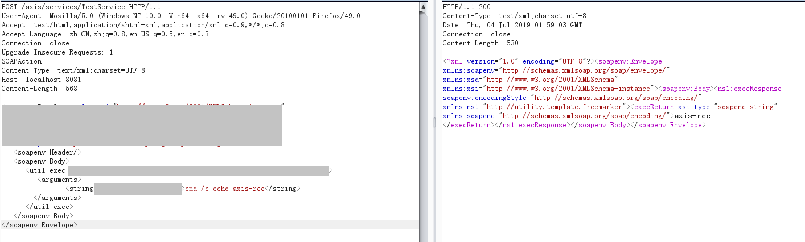
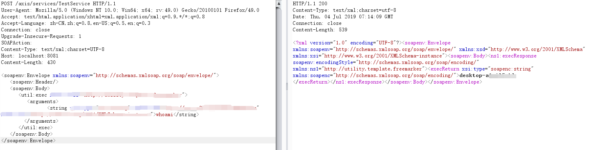

# Apache AXIS <=1.4 远程命令执行复现

## 前言

先知上有师傅发了相关的分析文章：https://xz.aliyun.com/t/5513

大意是axis1的AdminService可通过soap请求添加相应类的Service，然后可执行类中的方法，但是这个类得满足一定的条件，而freemarker组件中的某个类满足这个条件且可传入参数造成命令执行

详细分析见先知原文

但是关键部分打码了，于是尝试本地复现

## 漏洞复现

1、环境搭建

win10+jdk1.8+tomcat8.5+axis1.4+freemarker-2.3.28

下载地址：

http://apache.fayea.com/axis/axis/java/1.4/

https://freemarker.apache.org/freemarkerdownload.html

将下载的axis-bin-1_4压缩包中的webapps目录下的axis目录拷贝到tomcat的webapps目录下

然后将下载的最新freemarker-2.3.28.jar放在axis\WEB-INF\lib目录下

启动tomcat后访问`http://localhost:8080/axis`，我本地是8081端口

本地测试漏洞环境已搭好，但是远程是不能利用的，因为默认配置是关闭远程管理的，如果开启则可远程利用

这时候的axis\WEB-INF是没有server-config.wsdd文件的，应该是使用的源码的默认配置

2、漏洞利用

根据先知上的文章，构造第一步请求很简单，就是新增一个自定义的Service，并对应可利用的类template.utility.Execute，其中Service的名字随意，注意请求头得有SOAPAction

新增成功后会生成server-config.wsdd文件，里面有相关配置

查看新增的Service

然后需要根据新增的Service服务调用执行命令的函数exec，参数类型是List，List在xml结构中可以看作Array结构

但是在这里卡住了，构造了很久都没成功

后来利用burp的wsdler插件解析，然后再尝试构造

直接发送报错

把一些看不懂的先去掉试试

返回提示需要参数，说明方向是对的，接下来还是回到参数的构造了，应该是需要构造字符串类型，但是怎么表示字符串呢？了解下soap和xml之后，最终成功执行命令

可以简短一点

## 总结

主要是因为Axis的未授权访问，但默认配置下是不允许远程访问AdminService的，可通过添加Service服务在有限条件下调用任意函数，即需要结合满足一定条件的类进行相关利用

## 知识点

soap协议简介：

https://www.w3cschool.cn/soap/

xml schema:

https://www.w3cschool.cn/xmlschema

xml数据类型：

https://www.w3.org/TR/xmlschema11-2/#built-in-primitive-datatypes

## TODO

1、利用请求的精简程度不如先知原文，应该还有什么tips

2、Axis2登录进入管理后台能上传自定义Service，是否能执行任意代码？

